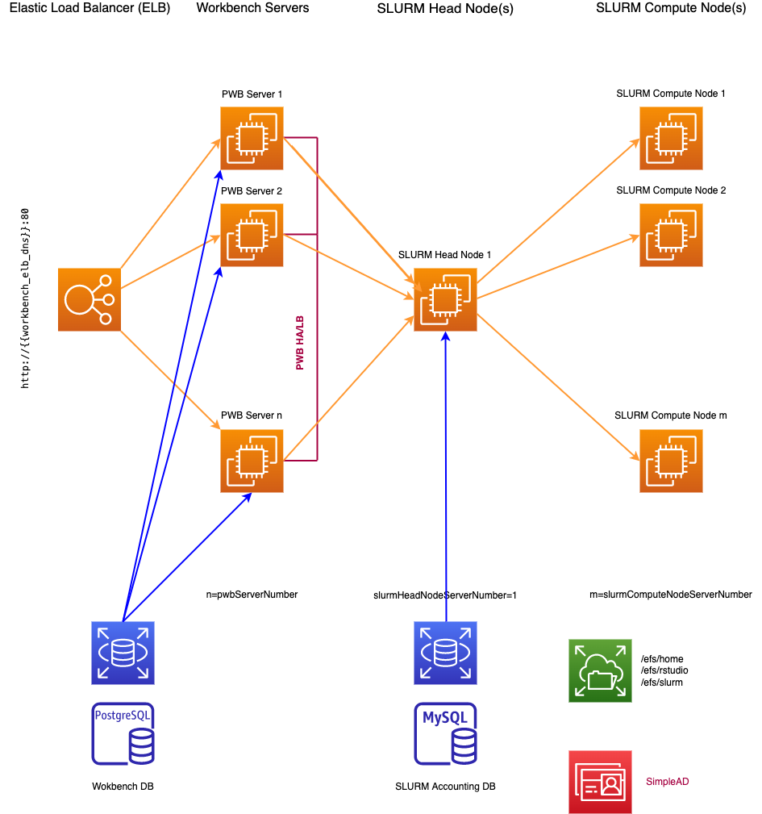

# A generalized and scalable architecture for Posit Workbench with SLURM launcher

## Introduction

This repository contains a pulumi recipe that will stand up a Posit Workbench environment with a customisable number of Workbench servers, all connected to an Elastic Load Balancer (ELB) and internally using Workbenches load-balancer as well. Each Workbench server can submit jobs via the SLURM Launcher against a SLURM cluster with arbitrary number of compute nodes of a given type. All servers are integrated into SimpleAD Active Directory. Shared storage is exclusively [EFS](https://aws.amazon.com/efs/) and is used for the SLURM installation, user home directories and Workbench configuration files. 

## Architectural principles 



The environment will be deployed in the default VPC for a given AWS account. It will use the last subnet/availability zone configured for this VPC. 

Any EC2 instance configured will have no limitations in terms of outgoing network connections (egress). The incoming connections (ingress) are however limited to the following ports

| Port Number/Range   |      Meaning      | CIDR Block |
|----------|-------------|------------|
| 22 | Secure Shell Access | 0.0.0.0 |
| 2049 |NFS/EFS | 0.0.0.0 |
| 8787 | Posit Workbench UI | 0.0.0.0 |
| 5432| PostgreSQL DB connection | subnet |
| 5559| Posit Workbench Launcher | subnet |
| 8617| SLURM Controller Daemon (slurmctld) | subnet |
| 8617| SLURM Compute Node Daemon (slurmd) | subnet |
| 32768-60999 | Port range for ephemera ports (ip_local_port_range) used by both rsession and slurmd | subnet

While the infrastructure bits are set up using [pulumi](https://www.pulumi.com/), the software installations are done by connecting pulumi with [just](https://github.com/casey/just). 


## List of parameters

The operating system is used is Ubuntu 20.04 LTS (Bionic) but anything else can be configured as needed (cf. `Pulumi.yaml`):

| Name   |      Parameter      | default Value |
|----------|-------------|------|
| SLURM Version |  `slurmVersion` | `22.05.8-1` |
| SLURM Head Node Instance Type |   `slurmHeadNodeInstanceType` |  `t3.xlarge` |
| Number of SLURM Head Nodes | `slurmHeadNodeServerNumber` |  `1`  |
| SLURM Compute Node Instance Type |   `slurmComputeNodeInstanceType`  |  `t3.medium` |
| Number of SLURM Compute Nodes | `slurmHeadNodeServerNumber` |  `2`  |
| AMI for SLURM nodes | `slurmAmi` | `ami-0d2a4a5d69e46ea0b ` |
| Posit Workbench Version |  `pwbVersion` | `2023.03.0-386.pro1` |
| Posit Workbench Node Instance Type |   `pwbInstanceType`  |  `t3.xlarge` |
| Number of Posit Workbench Nodes | `pwbServerNumber` |  `1`  |
| AMI for SLURM nodes | `pwbAmi` | `ami-0d2a4a5d69e46ea0b`  |
| Domain Name (SimpleAD) | `Domain` | `pwb.posit.co` |
| Domain Password| `DomainPW` | `S0perS3cret!` |
| AWS Region| `region` | `eu-west-1` |


## How to use this

### Prerequisites
* AWS SSO configured or `AWS_ACCESS_KEY_ID` and `AWS_SECRET_ACCESS_KEY` set in your current terminal.
* [pulumi](https://www.pulumi.com/) and [just](https://github.com/casey/just) installed
* Create a new key pair for passwordless ssh conenction to EC2 instance 

```
just key-pair-new
```

* Set Pulumi configuration variables (replace `XXX` with your eMail)address

```bash
pulumi config set email <XXXX>
pulumi config set --secret rsw_license $RSW_LICENSE
cat key.pub | pulumi config set public_key
```

### Spin up the infrastructure

First, let's initialize the stack and give it a name, e.g. `teststack`

```bash
pulumi stack init teststack
```

Now let's select this stack

```bash
pulumi stack select teststack
```

and finally start the environment 

```bash
pulumi up -y
```

Once the environment is up and running, you will need to create the users via running 

```bash
just create-users
```

which will run by default 10 users named `positXXXX` with password Testme1234 where `XXXX` is a 4 character string zero-padded string representation of a number ranging from 1 to 10, e.g. `XXXX=0002`. You can create more users by adding an integer number fo the `just create-users` command (e.g. `just create-users 100` will create 100 users) 

### Terminate the infrastructure

```
pulumi destroy -y 
```

## Acknowledgments

This work would have been impossible without the work of [Sam Edwardes](https://github.com/SamEdwardes), a fellow solution engineer at Posit PBC and his work on posit specific [pulumi recipes](https://github.com/sol-eng/pulumi-recipes)


